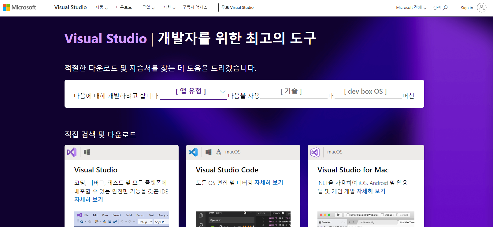
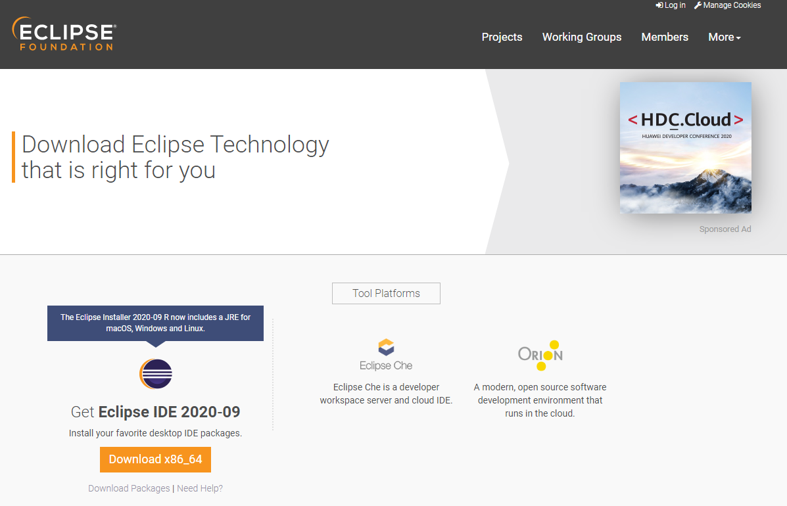

# IDE

IDE가 프로그램을 개발할 때 사용되는 도구들의 집합체 소프트웨어라고 할 수 있다고 했었습니다. 여기서 집합된 '도구'들은 IDE마다 다르지만 보통은  
__편집기__  
__언어팩__  
__git 연동__ 
__터미널__  
__여러가지 테마__  
__기타 플러글인__  
등 많은 것들이 포함됩니다.

IDE 역시 종류가 굉장히 다양합니다.

### 1. Visual Studio
Visual Studio는 마이크로소프트사에서 만든 IDE로, 특히 C계열의 언어를 개발할 때 많이 이용합니다.  

### 2. Xcode
IOS 네이티브 앱 개발에 필수인 맥에서 사용되는 IDE입니다.  
`이미지 준비중`

### 3. Eclipse
Oracle에서 개발한 IDE로, 주로 Java 개발에 많이 이욛됩니다.  
