# 들어가기에 앞서

여러분들이 unibook을 사용하기에 앞서 필요한 준비물이 있습니다. 지금부터  
__Visual Studio Code(VScode)__  
__bash__  
__gcc__  
__macOS/Window/Linux__  
__GitHub__  
__StackOverflow__  
에 대한 간단한 설명이나 실행/사용법을 순서대로 알려드리겠습니다.

## Visual Studio Code(VScode)
: 마이크로소프트에서 개발한 **문서 편집기**로, txt, C, C++등 다양한 확장자의 문서를 편집할 수 있습니다. macOS, Window, Linux의 모든 운영체제 지원합니다.

### 설치(macOS, Window, Linux)

### 1 macOS
    준비중
    
### 2 Windows
  VScode는 컴파일러를 따로 포함하고 있지 않기 때문에  컴파일러(gcc)를 설치해주어야합니다.
  컴파일러에 대한 설명은 뒤에 gcc부분에서 더 자세하게 설명해드리겠습니다.  

  #### VScode를 설치하기에 앞서 컴파일러부터 설치해보겠습니다.
  1 Windows에서 gcc를 사용할 수 있게 해주는 __MinGW__ 를 설치합니다.
  아래 사이트로 들어가 SourceForge를 눌러서 다운받습니다. 
  http://mingw-w64.org/doku.php/download/mingw-builds

  Setting은 본인 컴퓨터 사양에 맞게 해줍니다.  
  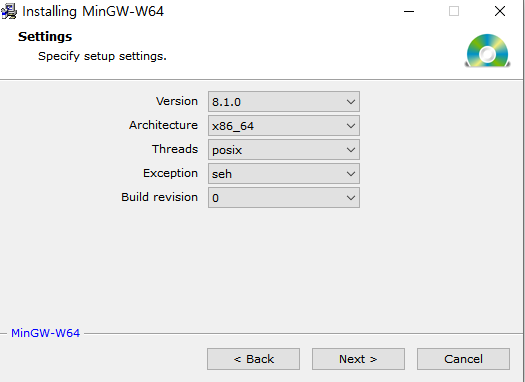

  설치가 끝난 후 Window+R로 실행창을 켜 sysdm.cpl을 입력합니다.  
  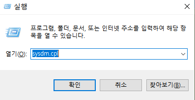

  시스템 속성 창에서 고급 -> 환경변수창을 연 뒤, 사용자 변수에서 Path를 선택한 후, '편집'을 선택합니다.  
  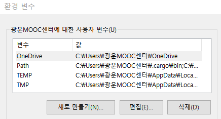

  새로만들기를 선택하여 아래의 경로를 입력해줍니다.  
  __C:\Program Files\mingw-w64\x86_64-8.1.0-posix-seh-rt_v6-rev0\mingw64\bin__  

  마지막으로 cmd창에서 __gcc --version__ 명령어를 입력하여 gcc가 정상적으로 설치되었는지 확인합니다.  
  [vscodeDownload_window_6](./img/vscodeDownload_window_6.PNG)


  #### 이제 VScode를 설치해보겠습니다.
  https://code.visualstudio.com/ 로 이동하여 vscode를 다운받습니다.  
  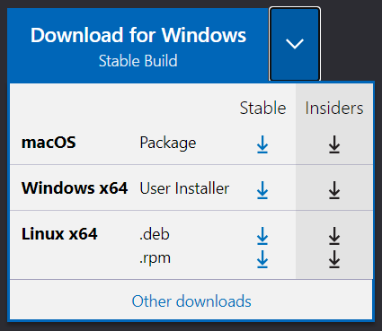

  다운 완료 후 첫 실행화면입니다.  
  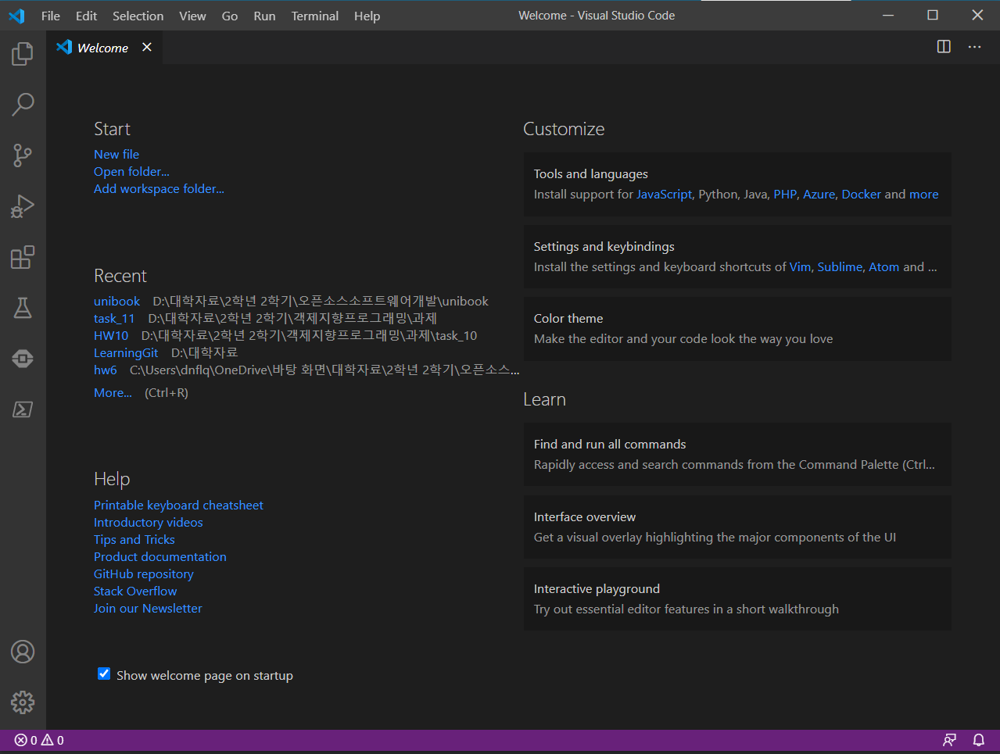

  다음의 아이콘을 선택하면 필요한 extension(확장프로그램)을 설치할 수 있습니다.(Ctrl+Shift+x)  
  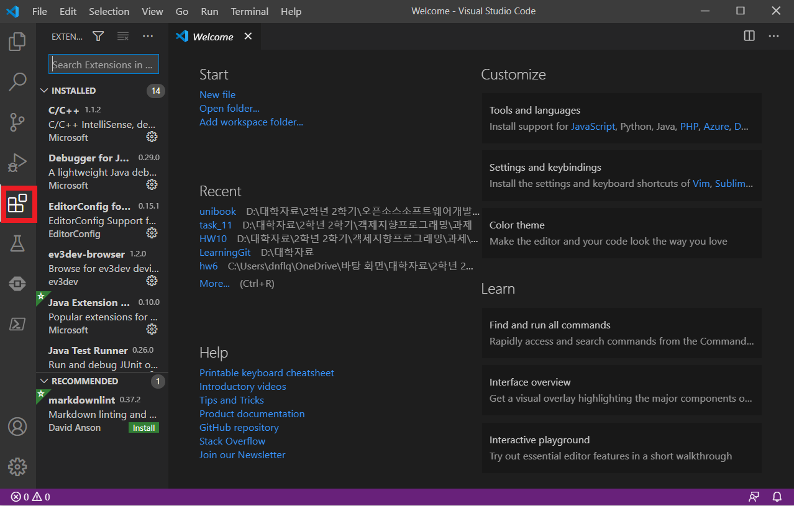  

  다음으로 Terminal -> Configure Default Build Task... -> Create tasks.json file from template -> MSBuild  
  순으로 선택하여 tasks.json 파일을 아래와 같이 수정합니다.

    ```{
    "version": "2.0.0",
    "runner": "terminal",
    "type": "shell",
    "echoCommand": true,
    "presentation" : { "reveal": "always" },
    "tasks": [
            //C++ 컴파일
            {
            "label": "save and compile for C++",
            "command": "g++",
            "args": [
                "${file}",
                "-o",
                "${fileDirname}/${fileBasenameNoExtension}"
            ],
            "group": "build",

            //컴파일시 에러를 편집기에 반영
            //참고:   https://code.visualstudio.com/docs/editor/tasks#_defining-a-problem-matcher

            "problemMatcher": {
                "fileLocation": [
                    "relative",
                    "${workspaceRoot}"
                ],
                "pattern": {
                    // The regular expression. 
                    //Example to match: helloWorld.c:5:3: warning: implicit declaration of function 'prinft'
                    "regexp": "^(.*):(\\d+):(\\d+):\\s+(warning error):\\s+(.*)$",
                    "file": 1,
                    "line": 2,
                    "column": 3,
                    "severity": 4,
                    "message": 5
                }
            }
        },
        //C 컴파일
        {
            "label": "save and compile for C",
            "command": "gcc",
            "args": [
                "${file}",
                "-o",
                "${fileDirname}/${fileBasenameNoExtension}"
            ],
            "group": "build",

            //컴파일시 에러를 편집기에 반영
            //참고:   https://code.visualstudio.com/docs/editor/tasks#_defining-a-problem-matcher

            "problemMatcher": {
                "fileLocation": [
                    "relative",
                    "${workspaceRoot}"
                ],
                "pattern": {
                    // The regular expression. 
                    //Example to match: helloWorld.c:5:3: warning: implicit declaration of function 'prinft'
                    "regexp": "^(.*):(\\d+):(\\d+):\\s+(warning error):\\s+(.*)$",
                    "file": 1,
                    "line": 2,
                    "column": 3,
                    "severity": 4,
                    "message": 5
                }
            }
        },
    
        
        // // 바이너리 실행(Windows)
        {
                "label": "execute",
            "command": "cmd",
            "group": "test",
            "args": [
                "/C", "${fileDirname}\\${fileBasenameNoExtension}"
                ]
    
        }
    ]
    }
    ```

이제 마지막입니다. File -> Preference -> Keyboard Shortcuts(Ctrl+K Ctrl + S)  
로 이동하여 keybindings.json 파일을 아래와 같이 수정합니다.
    ```// Place your key bindings in this file to override the defaults
    [
        { "key": "ctrl+alt+c", "command":"workbench.action.tasks.test"}
    ]
    ```

### 3 Linux
Linux에서는 macOS나 Windows와 다르게 터미널 창에서 VScode를 설치할 수 있습니다.(터미널은 Ctrl+Alt+T 단축키로 열 수 있습니다.)

명령어 입력으로 우선 컴파일러부터 설치해줍니다.  
`sudo apt-get install build-essential`

설치가 완료되면 아래의 명령어를 입력하여 정상설치 되었는지 확인합니다.  
`gcc --help`


이어서 VScode를 설치해보겠습니다.

1 MS의 GPG를 다운받기 위한 curl 패키지를 설치합니다.  
`sudo apt-get install curl`

2 GPG를 다운받아서 /etc/apt/trusted.gpg.d/ 경로에 복사합니다.  
`sudo sh -c ' curl https://packages.microsoft.com/keys/microsoft.asc | gpg --dearmor > /etc/apt/trusted.gpg.d/microsoft.gpg '`

3 VScode를 다운받기 위한 저장소를 /etc/apt/sources.list.d/ 경로에 추가해주겠습니다.  
`sudo sh -c ' echo " deb [arch=amd64] https://packages.microsoft.com/repos/vscode stable main " > /etc/apt/sources.list.d/vscode.list '`

4 패키지를 다운받았으므로 업데이트를 해줍니다.  
`sudo apt-get update`

5 VScode를 설치합니다.  
`sudo apt-get install code`  

6 3에서 추가했던 저장소를 삭제합니다.  
`sudo rm /etc/apt/sources.list.d/vscode.list`  

VScode의 설치가 완료된 후, 터미널 창에 code라고 입력하여 VScode를 실행시킬 수 있습니다.  
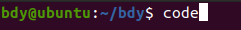

VScode를 실행시킨 후, Extentions(Ctrl+Shift+X)창을 열어서 원하는 확장 프로그램을 설치해줍니다.  
우선 C/C++을 설치해보겠습니다.  
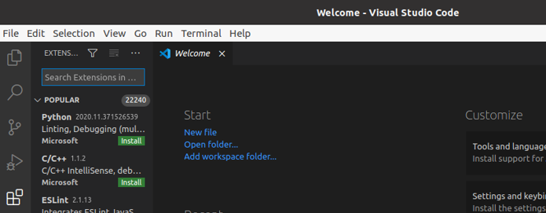

Open Folder(Ctrl+Shift+E)에서 작업할 폴더를 선택할 수 있습니다.  


다음으로 Terminal -> Configure Default Build Task... -> Create tasks.json file from template -> MSBuild  
순으로 선택하여 tasks.json 파일을 아래와 같이 수정합니다.  
 ```
 {
      "version": "2.0.0",
      "runner": "terminal",
      "type": "shell",
      "echoCommand": true,
      "presentation": {"reveal": "always"},
      "tasks": [
          //C++
          {
              "label":"save and compile C++",
              "command":"g++",
              "args":[
                  "-g3"
                  "${file}",
                  "-o",
                  "${fileDirname}/${fileBasenameNoExtension}"
              ],
              "group": "build",

              "problemMatcher":{
                  "fileLocation":[
                      "relative",
                      "${workspaceRoot"
                  ],
                  "pattern": {
                      "regexp":"^(.*):(\\d+):(\\d+):\\s+(warning error):\\s+(.*)$",
                      "file":1,
                      "line":2,
                      "column": 3,
                      "severity": 4,
                      "message": 5
                  }
              }
          },
    //C
          {
              "label":"save and compile C",
              "command":"gcc",
              "args":[
                  "-g3"
                  "${file}",
                  "-o",
                  "${fileDirname}/${fileBasenameNoExtension}"
              ],
              "group": "build",

              "problemMatcher":{
                  "fileLocation":[
                      "relative",
                      "${workspaceRoot"
                  ],
                  "pattern": {
                      "regexp":"^(.*):(\\d+):(\\d+):\\s+(warning error):\\s+(.*)$",
                      "file":1,
                      "line":2,
                      "column": 3,
                      "severity": 4,
                      "message": 5
                  }
              }
          },
          {
              "label": "execute",
              "command":"cd ${fileDirname} && ./${fileBasenameNoExtension}",
              "group": "test"
          }
      ]
}
```


이제 마지막입니다. File -> Preference -> Keyboard Shortcuts(Ctrl+K Ctrl + S)  
로 이동하여 keybindings.json 파일을 아래와 같이 수정합니다.(컴파일/실행 단축키를 설정하는 것입니다.)  

    // Place your key bindings in this file to override the defaults
    [
        //compile
        { "key": "ctrl+shift+1", "command":"workbench.action.tasks.build"},
        //execution
        { "key": "ctrl+shift+2", "command":"workbench.action.tasks.test"}
    ]

## bash
bash는 __(셸)Shell__ 의 한 종류 입니다. (셸은 bash말고도 zbash, ksh, csh 등 여러 종류가 있습니다.)  
셸은 '명령어 처리기'로, 사람이 컴퓨터에게 일을 시킬 때 쓰는 프로그램이라고 할 수 있습니다.   
우리가 명령어를 입력하면 셸이 받아들이고 명령어를 해석하여 커널을 사용하여 하드웨어를 조작합니다.  


## gcc
gcc는 __GNU Compiler Collection__ 의 약자로, 언어 컴파일러입니다.  
여기서 컴파일러란, C와 같은 고급언어를 binary code(이진코드)와 같은 저급언어로 변환해주는 프로그램입니다.  
사람이 이해할 수 있는 C언어를 컴퓨터가 이해할 수 있는 binary code로 변환해주는 것이죠.

위에서 언급했듯이 Visual Studio Code는 컴파일러가 포함되어있지 않기 때문에 따로 설치를 해주었습니다.  


## macOS/Window/Linux
흔히 컴퓨터는 0과 1밖에 모른다고 합니다. 사실 엄밀히 말하면 0과 1도 모르죠. 사용자가 어떤 행동을 해서 전기신호를 주면, __'전압이 충분하지 않다'__ 와 __'전압이 충분하다'__ 그 정도를 구분할 수 있습니다.  
하지만 사용자가 컴퓨터를 사용하기 위해 일일히 전기신호를 입력해줄 수는 없는 노릇입니다.  
여기서 사용자가 컴퓨터를 쉽게 다룰 수 있게 해주는 인터페이스를 운영체제(=Operating System = OS)라고 합니다. 하드웨어와 소프트웨어를 관리하는 소프트웨어라고 할 수 있죠.

macOS, Window, Linux는 주로 널리 사용되는 운영체제입니다.  


## Gihub
Github는 __버전 관리 시스템__ 입니다.  
우리가 프로젝트를 진행할 때 완전히 혼자 하는 경우는 드물며, 대부분 다른 사람들과 함께 진행하게 됩니다. 이 때 프로젝트를 더 간편하게 관리하기 위해서 사용하는 것이 Github입니다. Github에 대한 자세한 설명은 [VCS, 그리고 오픈소스](vcs_and_opensource.md)에서 다루기로 하고 여기서는 Github 계정만 만들어보겠습니다. 

우선 Github 사이트에 들어갑니다.
https://github.com/  

Sign up으로 회원가입을 진행합니다.  
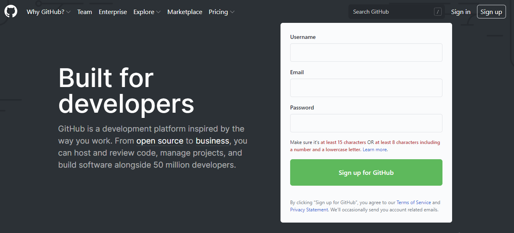

이메일 인증까지 모든 과정을 완료하면 아래와 같이 가입이 완료됩니다.  
프로젝트를 위해서 repository를 생성하거나, team프로젝트를 위해 organization을 만들거나, Github 이용법에 대해서 볼 수 있는 선택지가 보입니다.  
일단은 Skip this for now로 넘어가 줍시다.  


이렇게 github 가입을 간단하게 완료했습니다.

## StackOverflow
StackOverflow는 질문/답변 사이트입니다.  
https://stackoverflow.com/  

Sign up으로 회원가입을 해봅니다.  


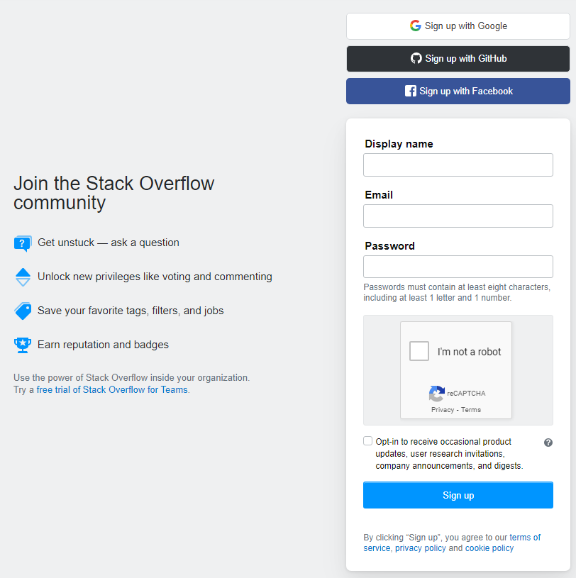  

회원가입을 완료한 후, 로그인을 하면 __Search__ 로 검색하거나 __Ask Question__ 으로 질문을 올릴 수 있습니다.  
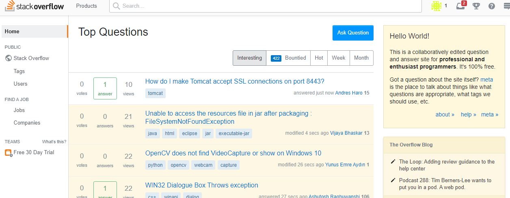
