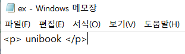
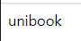
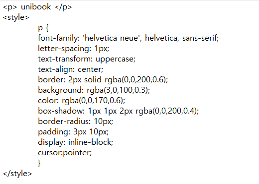
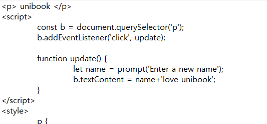
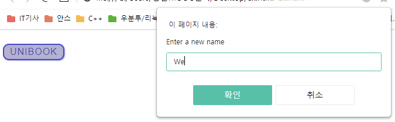

# Javascript의 위엄

이번 페이지에서는 __자바스크립트__ 에 대해 다뤄보겠습니다.  
자바스크립트는 무슨 언어일까요? '자바'라는 말이 붙었으니까 프로그래밍 언어라고 생각해볼 수도 있겠습니다.  
절반 정도는 맞는 말이라고도 할 수 있을지 모르지만, 자바스크립트도 __웹페이지를 개발__ 하는데 사욛됩니다.  
단순히 웹에 어떤 부분이 제목으로 나오고 본문으로 나오는 지와 같은 기본 기능을 넘어서 __복잡한 기능__ 을 구현하는 데에 사용됩니다. 단순 마크업 언어는 아니고 __스크립트 혹은 프로그래밍 언어__ 이죠.  

앞 장에서 언급했던 HTML, CSS와 같이 어떤 느낌인지 예시를 보겠습니다.  

우선 메모장에 __ex.html__ 이라는 이름으로 HTML파일을 하나 작성해봤습니다.  
  
  
작성한 코드가 웹페이지에 나타난 것을 확인했습니다.  

  
  
작성한 HTML에 CSS를 적용시킨 모습입니다.  

  
  
  
자바스크립트 코드를 작성했습니다. 버튼을 누르면 name을 작성하고, 버튼 속 글씨가 바뀌게 되죠.  

HTML과 CSS와 다르게 자바스크립트는 컴퓨터에게 어떠한 동작을 시킬 수 있기 때문에 __스크립트 프로그래밍 언어__ 라고 합니다.  

