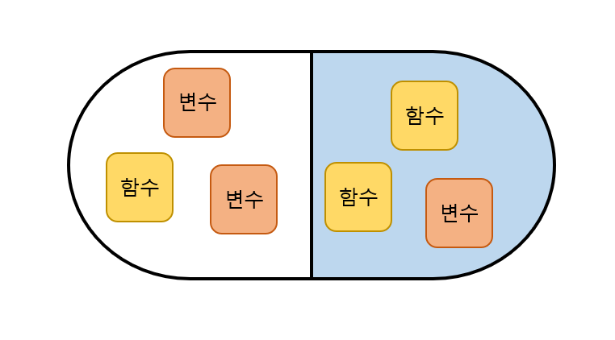
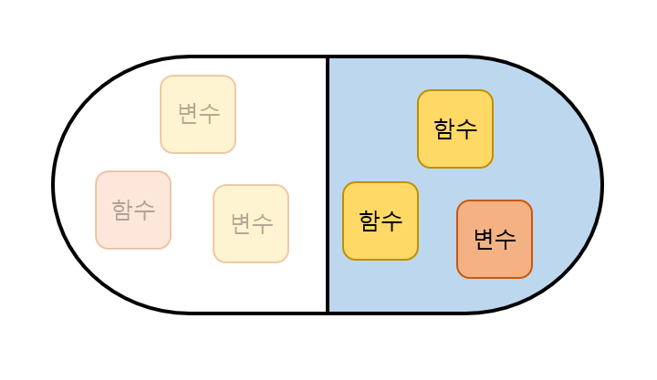
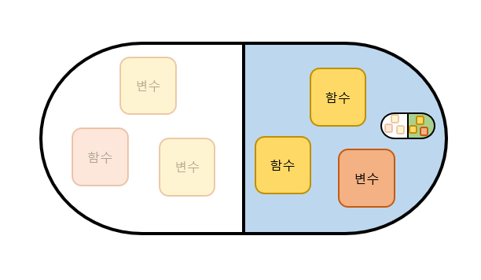

# 8.2
## 그놈의 객체지향

프로그래밍 언어를 처음 알아보다보면 __절차지향, 객체지향__ 이라는 두 말이 많이 보입니다. 그리고 두 가지의 차이가 뭔지에 대해서 설명하는 글도 많이 찾아볼 수 있는데, 사실 아무리 설명을 봐도 한번에 와닿지는 않을 것입니다. 그래도 무작정 해보는 것보다는 대략적인 느낌을 가져보는 게 좋겠죠?  

### 절차지향(PP)
: __순차적인 처리__ 를 중요시하여 프로그램 전체가 __유기적__ 으로 연결되도록 함.  

#### 장점
- 컴퓨터의 처리구조와 비슷해 실행속도가 빠름  

#### 단점
- 유지보수가 어려움  
- 코드 순서가 바뀌면 오류가 생길 수 있음  
- 디버깅이 어려움  
- 프로그램을 분석하기 어려움  

### 객체지향(OOP)
: __기능별__ 로 묶는 __캡슐화__ 를 하여 캡슐을 재활용함.  

#### 장점
- 코드의 재활용성이 높음  
- 코딩이 절차지향보다 간편함  
- 디버깅이 쉬움  

#### 단점
- 처리속도가 절차지향보다 느림  
- 설계에 시간이 오래걸림  

글로 먼저 짧게 작성해봤는데요, 그림으로 한번더 간단하게 얘기해보겠습니다.  
  
객체지향에서 사용되는 __'캡슐'__ 을 그림으로 나타내보았습니다.  
캡슐 안에는 변수(재료)와 함수(기계)가 들어있습니다.  
함수는 변수를 사용하여 각자의 주어진 기능을 진행합니다.  

  
캡슐의 흰 부분에 있는 변수와 함수들은 다른 사람들이 함부로 손댈 수 없게 할 수도 있습니다.  

  
그리고 하늘색 캡슐의 변수나 함수를 상속한 초록색 캡슐도 만들 수 있습니다.  

  
우리가 만든 캡슐을 먹은 각자 다른 동물들이 있습니다.  
같은 캡슐을 먹었지만 각각의 동물의 몸속에 있기 때문에 각 캡슐들은 서로 영향없이 일을 할 것입니다.  

우리는 저 캡슐에서 필요한 함수(기능)이 있을 때마다 그 함수만 뽑아서 사용하면 됩니다.  
__새는 밥을 먹도록,__  
__거북이는 하품을 하도록,__  
__물고기는 잠을 자도록__  
물론 새도 하품을 하거나 잠을 잘 수 있고, 거북이도 먹거나 잠을 잘 수 있습니다.  

객체지향은 대략 이런 느낌입니다. 사실 완전히 이해하는 데에는 어떤 설명보다 직접 프로그램을 하나 작업해보는 것이 가장 좋은 방법이기 떄문에 이정도의 이야기로 마치겠습니다.