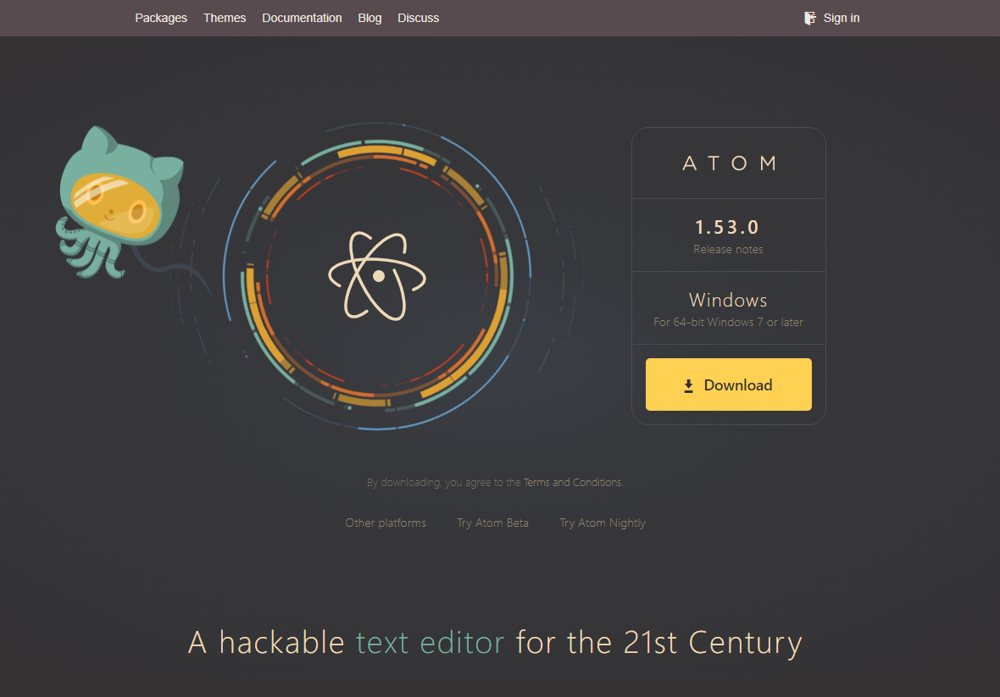
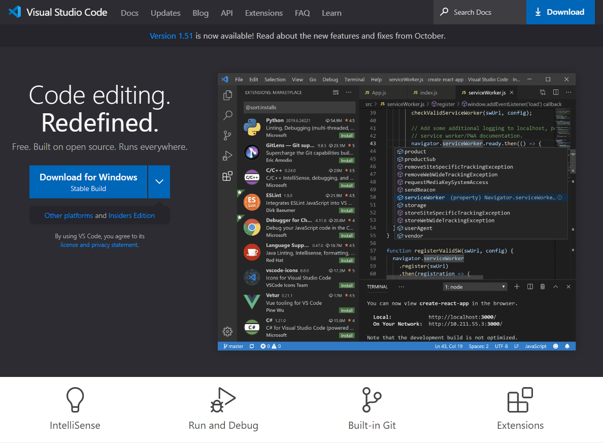

# 텍스트 에디터

앞선 페이지에서는 메모장을 텍스트 에디터로 예시를 들었지만 우리가 프로그래밍을 하며 사용하는 텍스트 에디터는 메모장보다 더 다양한 기능을 제공하는 것들을 주로 사용합니다.  
텍스트 에디터는 간단한 기능들만 제공하면 되기 때문에 그 종류는 매우 다양하게 있습니다.

### 1. Atom
Github에서 개발한 텍스트 에디터입니다. (https://atom.io/)  
초심자들이 사용하기에 좋고, 적용할 수 있는 테마가 다양하며 거대한 사용자 커뮤니티가 있습니다.  
단점으로는 프로그램이 굉장히 무겁다는 점이 있습니다.

_사이트에 들어가면 귀여운 고양이쭈꾸미가 반겨주네요_  

### 2. Visual Studio Code
우리가 설치했던 편집기죠. 마이크로소프트사에서 개발한 텍스트 에디터입니다.  
atom보다 속도가 훨씬 빠르고 가볍습니다. 그리고 atom보다 설정할 수 있는 것들이 많다는 장점이 있습니다.  
