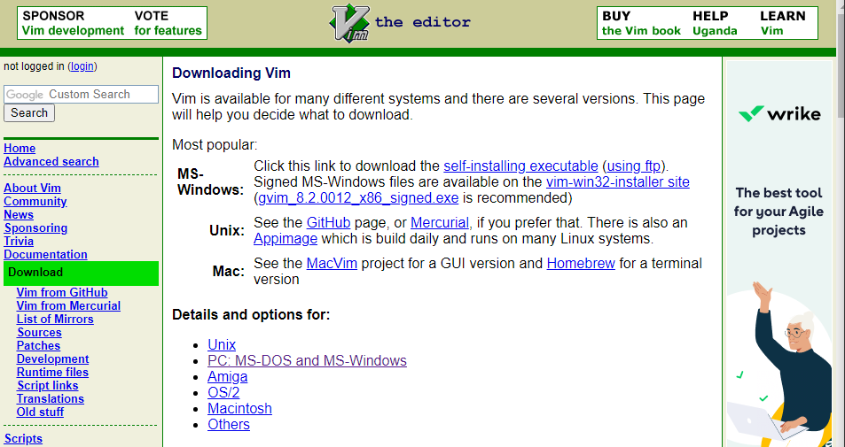
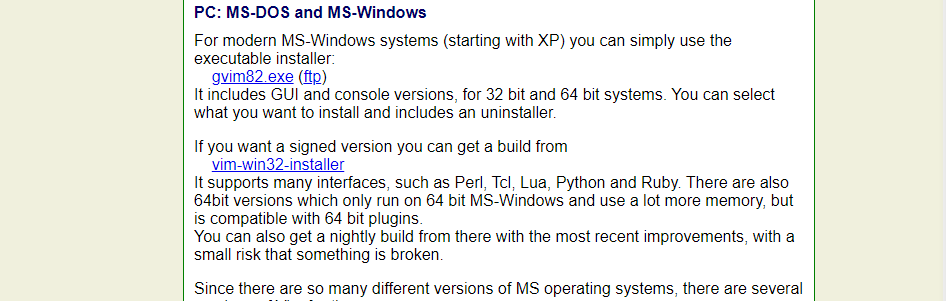
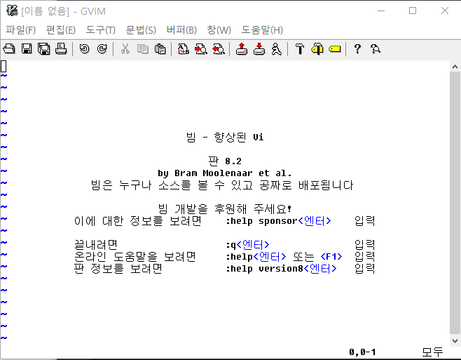
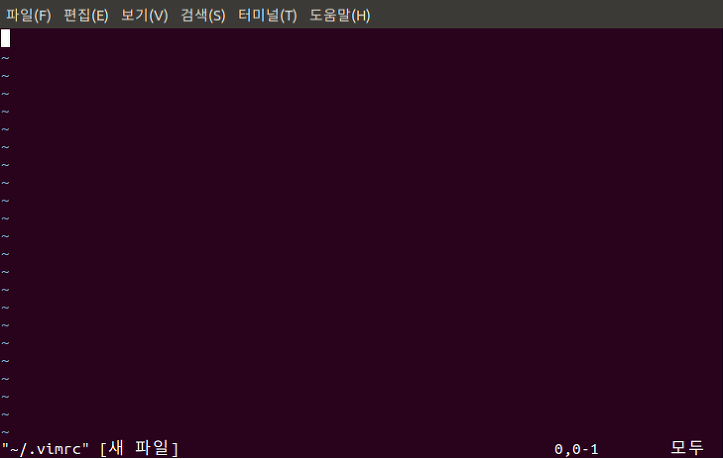
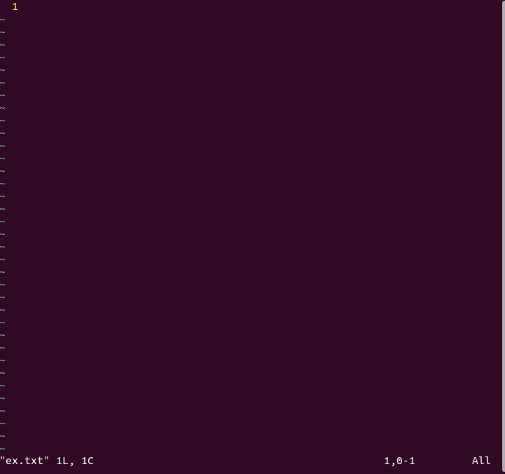

# 2.5
## Vim 튜토리얼

그럼 Vim을 간단하게 한 번 사용해보겠습니다.  

우선 vim을 설치하는 것부터 해보겠습니다.  
### Windows
다음 사이트로 들어가서 PC: MS-DOS and MS-Windows로 들어갑니다.  
https://www.vim.org/download.php  
  

다음으로 gvim82.exe 를 찾아 다운받습니다.(gvim 옆의 숫자는 바뀔 수도 있습니다.)  
  

윈도우에 gVim을 입력하여 Vim을 실행시킨 화면입니다.  
  

### Linux
이어서 리눅스에서 Vim을 설치해보겠습니다.  

우선 터미널창을 열어준 뒤 명령어를 차례로 입력합니다.  
```sudo apt-get upadate```  
```sudo apt-get install vim```  
위의 명령어 두 줄을 입력하면 vim 설치는 끝납니다. 간단하죠?

이 밑에서 하는 것들은 추가 기능을 위한 것입니다.  
아래 명령어는 vi 편집기로 홈 디렉토리(~)에 .vimrc 파일을 생성한다는 명령어입니다.  
```vi ~/.vimrc```  
  
위 화면에서 i를 입력하면 쓰기 모드가 됩니다. 아래 설정들을 입력합시다.  
```
set number    " line 표시
set ai    " auto indent
set si " smart indent
set cindent    " c style indent
set shiftwidth=4    " 자동 공백 채움 시 4칸
set tabstop=4    " tab을 4칸 공백으로
set ignorecase    " 검색 시 대소문자 무시
set hlsearch    " 검색 시 하이라이트
set nocompatible    " 방향키로 이동 가능
set fileencodings=utf-8,euc-kr    " 파일 저장 인코딩 : utf-8, euc-kr
set fencs=ucs-bom,utf-8,euc-kr    " 한글 파일은 euc-kr, 유니코드는 유니코드
set bs=indent,eol,start    " backspace 사용가능
set ruler    " 상태 표시줄에 커서 위치 표시
set title    " 제목 표시
set showmatch    " 다른 코딩 프로그램처럼 매칭되는 괄호 보여줌
set wmnu    " tab 을 눌렀을 때 자동완성 가능한 목록
syntax on    " 문법 하이라이트 on
filetype indent on    " 파일 종류에 따른 구문 강조
set mouse=a    " 커서 이동을 마우스로 가능하도록
```
위의 내용을 작성한 후, Esc를 누르면 명령어 모드로 바뀝니다. :를 입력한 후 명령어로 wq를 입력하면 저장및 종료됩니다. 앞으로 vim 파일명을 입력하면 vim을 사용하여 문서 편집을 할 수 있습니다.  

### Vim 사용해보기
Vim 설치를 완료했으니 Vim을 간단하게 사용해보겠습니다.  
Vim을 처음 사용해볼 땐 진입장벽이 있습니다. Ctrl+C, Ctrl+V 등이 먹히지 않는 등 기존 우리가 사용하던 편집기들과는 __사용법이 많이 다르기 때문__ 입니다. 하지만 익숙해지면 굉장히 편한 것이 또 Vim이기 때문에 틈틈히 익혀두면 좋을 것입니다.  

#### 명령어 입력하기
Vim에 명령어를 입력할 때는 콜론(:)을 먼저 입력한 후에 입력해야합니다. 예를 들어볼까요?  
ex.txt라는 이름으로 파일을 만들어보겠습니다.  
  

이런 창이 뜹니다.  
  

이 상태에서 뭔가를 입력하려고 하면 입력이 되지 않습니다. 여기서 :q를 입력하면 창을 나갈 수 있습니다.  
  
q가 vim을 종료하는 명령어이기 때문입니다.  
명령어를 정리해보면,
```
:q 종료
:w 저장
:w file.txt 파일명으로 저장
:w >> file.txt 파일에 덧붙여서 저장
:q! 강제종료
:wq 저장 후 종료
:wq! 강제 저장후 종료
```

입력을 하기 위해서는 입력모드로 전환해야합니다. 입력모드는 :를 입력할 필요가 없습니다.
```
i 커서의 위치에 입력
I 커서 행의 맨 앞부터 입력
a 커서 위치 다음 칸부터 입력
A 커서 행의 맨 마지막부터 입력
o 커서의 다음 행에 입력
O 커서의 이전 행에 입력
s 커서 위치의 한 글자를 지우고 입력
cc 커서위치의 한 행을 지우고 입력
```

입력모드에서 다시 명령어 모드로 돌아갈 때는 Esc 키를 누르면 돌아갈 수 있습니다.  
이 외에도 정말 다양한 기능들이 있지만, 너무 많기 때문에 이 페이지에서는 파일의 __생성, 작성, 저장, 종료__ 정도의 기능만 설명했습니다.  
순서대로 해보면 __vim 파일명 -> i -> 내용작성 -> Esc -> :wq__ 정도로 요약할 수 있겠군요.  

실행화면을 올리는 것보단 짧고 간단하게 사용법을 작성해봤습니다. vim은 익숙하지 않은 방식의 편집기이기 때문에 직접 해보면서 찾아보는 것만큼 익히는 데에 좋은 방법이 없다고 생각하기 때문입니다.  

분명 처음 배울 떄는 이걸 왜 사용하나 싶을 수 있지만, 꾸준히 사용하다보면 여러분도 vim말고는 사용하지 못하는 사람들 중 한 명이 될 수 있을지도 모르겠습니다.

