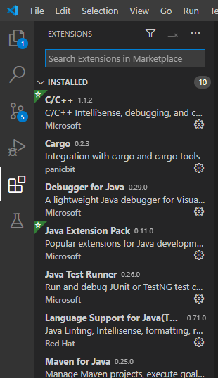
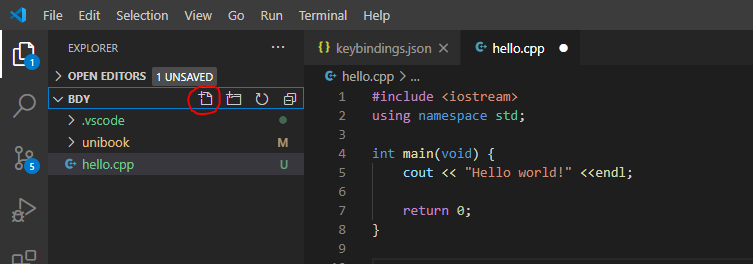

# Visual Studio Code

앞서 텍스트 에디터와 IDE에 대해서 알아보았습니다.  
여러분들이 학교에서는 아마 __Visual Studio__ 나 __Eclipse__ 로 수업을 진행할 것입니다. 그런데 왜 여기서는 __Visual Studio Code__ 를 처음에 설치하고 시작한 걸까요?  

__Visual Studio__ 나 __Eclipse__ 는 __IDE__ 입니다. 프로그램을 개발할 때 사용되는 도구들의 집합체인만큼 다양한 기능을 추가적인 설정이나 조작 없이도 빠르게 사용할 수 있도록 준비되어 있지만 그만큼 무겁다는 단점이 있죠.  
반면 __Visual Studio Code__ 는 텍스트 에디터이기 때문에 아주 가볍게 프로그램을 돌릴 수 있다는 장점이 있습니다. 물론 필요에 따라서 추가적인 설정 _(ex-tasks.json)_ 을 해야한다는 번거로움이 있긴 하지만 몇 번의 설정을 해주고 프로그래밍을 하는 내내 가볍게 돌릴 수 있다는 것은 큰 장점이 되죠.  

이 페이지에서는 __Visual Studio Code__ 를 가볍게 둘러보는 시간을 가져보겠습니다.

0. Visual Studio Code 첫 화면  
  
vscode를 실행시켰을 때의 첫 화면입니다. Welcome이라며 환영해주는군요.  
원한다면 한글팩을 다운받아서 한글버전으로도 사용할 수 있지만 우리는 앞으로 영어 사용에 익숙해지는 것이 좋기 때문에 이대로 진행해보겠습니다.

1. Explorer(탐색기) - Ctrl+Shift+E  
  
Welcome창을 닫아봤습니다. 창이 없어진 자리에 __Open File(Ctrl+O)__ 와 __Open Folder(Ctrl+K Ctrl+O)__ 가 눈에 띕니다.  
Open File을 하면 원하는 파일을 하나 열어서 창으로 띄워 편집할 수 있습니다.  
닫을 때는 __Ctrl+K Ctrl+O__ 나 해당 탭의 x표시 클릭으로 닫을 수 있습니다.  

Open Folder로는 작업할 폴더를 열어서 폴더 안의 파일들을 작업할 수 있습니다.  
닫을 때는 __Ctrl+K F__ 를 통해서 닫을 수 있습니다.   

2. Search(검색) - Ctrl+Shift+F  
  
전체 검색 기능입니다. 현재 열려있는 폴더 내의 모든 파일명, 파일 내의 내용까지 검색되는 것을 확인할 수 있습니다.  

3. Source Control(소스코드관리) - Ctrl+Shift+G

작성한 소스코드를 관리할 수 있습니다. 위의 사진을 보면 왼쪽 창은 비어있고, 오른쪽 창은 배경색이 초록색인 문장으로 가득한 것을 확인할 수 있는데요, 제가 비어있던 파일에 초록색만큼의 내용을 추가했다는 의미입니다. 소스코드관리는 Git으로 하는 습관을 가지는 것이 훨씬 좋기 때문에 사용법은 넘어가겠습니다.

4. Run(실행) - Ctrl+Shift+D
    준비중

5. Extensions(확장관리) - Ctrl+Shift+X  
  
확장 프로그램을 검색하여 설치할 수 있는 탭입니다. 원하는 extension(C, Java, Python 등)을 검색하고 필요한 것을 다운받아서 사용할 수 있습니다.  

6. Test
    준비중

VScode를 간단하게 둘러보았습니다. 이걸로 VScode를 충분히 사용할 수 있는데요, 흔히들 많이 해보는 hello world를 한 번 출력해보겠습니다.  
  
__BDY__ 폴더를 열고 빨간색 동그라미로 표시한 부분을 눌러서 __hello.cpp__ 파일을 생성하고 작성했습니다.

위 코드를 __Ctrl+S__ __Ctrl+Shift+C__ 를 순서대로 눌러서 저장하고 실행하면 터미널에 hello world가 출력되는 것을 확인할 수 있습니다.